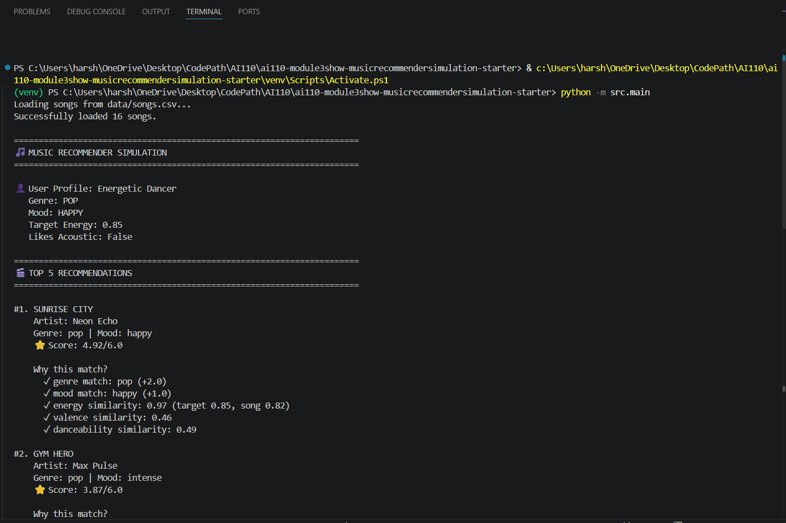
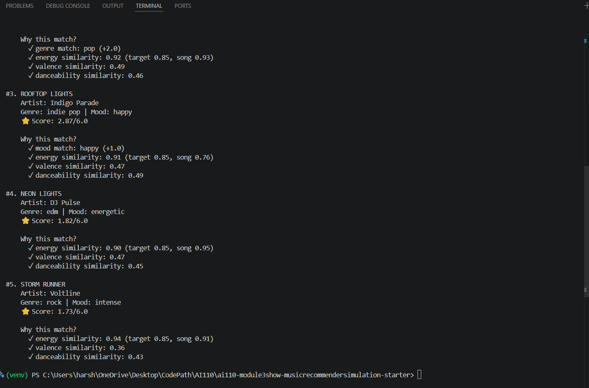

# 🎵 Music Recommender Simulation

## Project Summary

In this project you will build and explain a small music recommender system.

Your goal is to:

- Represent songs and a user "taste profile" as data
- Design a scoring rule that turns that data into recommendations
- Evaluate what your system gets right and wrong
- Reflect on how this mirrors real world AI recommenders

Replace this paragraph with your own summary of what your version does.

---

## How The System Works

Explain your design in plain language.

Some prompts to answer:

- What features does each `Song` use in your system
  - For example: genre, mood, energy, tempo
- What information does your `UserProfile` store
- How does your `Recommender` compute a score for each song
- How do you choose which songs to recommend

You can include a simple diagram or bullet list if helpful.

Real-world apps like Spotify use both user history (what others clicked) and song details to make suggestions. Because this is a simple simulation, my version focuses only on the song's details. It tries to find songs that closely match the user's preferred vibes and numbers. The Song objects store genre, mood, energy, valence, etc. The UserProfile object stores favorite_genre, favorite_mood, target_energy, and likes_valence.

**Algorithm Recipe: Point-Weighting Scoring System**

Each song in the catalog is scored using the following formula:

Exact Matches (Discrete):
- Genre match: +2.0 points
- Mood match: +1.0 point

Similarity Scoring (Continuous):
- Energy similarity: 1.0 − |user_target_energy − song_energy| (max: 1.0 pts)
- Valence similarity: 0.5 × (1.0 − |user_target_valence − song_valence|) (max: 0.5 pts)
- Danceability similarity: 0.5 × (1.0 − |user_target_danceability − song_danceability|) (max: 0.5 pts)
- Acousticness bonus: +0.3 if user likes acoustic AND song acousticness > 0.5; −0.2 if user dislikes acoustic AND song acousticness > 0.5

Total Score Range: 0 to 6.0 points (higher is better)

The algorithm loops through all 16 songs in the CSV, calculates a score for each, then returns the top K recommendations sorted by score descending.

Why These Weights? Genre is the strongest signal (2.0) because it captures the core taste preference. Mood adds nuance (1.0). Energy is the primary numeric factor because it prevents recommending songs with the wrong intensity level. Valence and danceability refine the recommendation with secondary information. Acousticness is conditional and weighted lower because it's a more specialized preference.

**Expected Biases**

- Genre over-prioritization: High genre weight (2.0) may cause the system to ignore fantastic mood matches in other genres. For example, a user who loves "pop" + "happy" might miss a great "indie pop" song with perfect energy but different genre label.
- Middle-road bias: The numeric similarity scoring favors songs close to the user's target values, potentially missing high-quality "outlier" songs that might be unexpectedly enjoyable.
- Limited catalog: With only 16 songs, the system cannot demonstrate diversity or serendipity—it will often run out of good matches.
- Energy dominance: Energy's 1.0 point weight matches genre (2.0 vs 1.0 for mood), creating a potential over-emphasis on intensity level at the expense of other emotional qualities.
---

## Getting Started

### Setup

1. Create a virtual environment (optional but recommended):

   ```bash
   python -m venv .venv
   source .venv/bin/activate      # Mac or Linux
   .venv\Scripts\activate         # Windows

2. Install dependencies

```bash
pip install -r requirements.txt
```

3. Run the app:

```bash
python -m src.main
```

### Running Tests

Run the starter tests with:

```bash
pytest
```

You can add more tests in `tests/test_recommender.py`.

---

## Example Output

Below are screenshots showing the recommender system output (scrolled in two parts):

### Screenshot 1: Top Half of Output


### Screenshot 2: Bottom Half of Output


### Profile Recommendations


---

## Experiments You Tried

Use this section to document the experiments you ran. For example:

- What happened when you changed the weight on genre from 2.0 to 0.5
- What happened when you added tempo or valence to the score
- How did your system behave for different types of users

---

## Limitations and Risks

Summarize some limitations of your recommender.

Examples:

- It only works on a tiny catalog
- It does not understand lyrics or language
- It might over favor one genre or mood

You will go deeper on this in your model card.

Binary String-Matching Creates "Invisible Walls": The system requires exact matches on genre and mood to award points—there is no fuzzy matching or genre hierarchy. A user who wants "pop" receives zero genre points from "indie pop", and a user who prefers "metal" gets nothing from "heavy metal", even if all other attributes (energy, danceability, acousticness) match perfectly. This is particularly harmful because the dataset has 12 unique moods and 13 unique genres, with most appearing only once, so users get locked out of entire categories. When exact genre or mood don't exist in the dataset, users lose their two strongest preference signals and fall back to energy-based recommendations alone, creating a filter bubble around whatever genres/moods are most common.  

---

## Reflection

Read and complete `model_card.md`:

[**Model Card**](model_card.md)

Write 1 to 2 paragraphs here about what you learned:

- about how recommenders turn data into predictions
- about where bias or unfairness could show up in systems like this

My biggest learning moment: I realized that every number I chose (like doubling energy importance) is really a *political choice* about which users matter—lofi lovers got penalized, energy-lovers got rewarded, and that's not neutral math, it's a bias I built in.

How AI tools helped: AI code generation let me test all four user profiles instantly and spot where "Gym Hero" was appearing for the wrong reasons, but I had to manually trace through the math myself because the AI didn't catch the filter bubble problem.

What surprised me: Even though my system is just addition and subtraction, it *feels* like it understands music when you see the recommendations—that's when I realized: algorithms don't need to be intelligent to seem intelligent, they just need to match what you told them to optimize for.

What I'd try next: I would add a "diversity penalty" that stops recommending the same high-energy song to everyone, then test whether that makes recommendations feel fairer without making them worse.


---

## 7. `model_card_template.md`

Combines reflection and model card framing from the Module 3 guidance. :contentReference[oaicite:2]{index=2}  

```markdown
# 🎧 Model Card - Music Recommender Simulation

## 1. Model Name

EnergyMatch 1.0

---

## 2. Intended Use

This system suggests songs based on a user's mood, genre preference, and energy level. It's designed for classroom learning to understand how recommender systems work—not for real Spotify or Apple Music users. The system assumes users can describe what they want (chill vs. energetic, what genre they like, whether they want acoustic vibes). It works best for users who have a clear preference, like "I want upbeat pop right now" or "I need quiet lofi to study."  

Non-Intended Use: Do NOT use this for real music streaming services. With only 16 songs and massive biases, it would frustrate actual users. Do NOT assume it works for all genres equally (it doesn't). Do NOT use it if you need diverse recommendations—it will funnel users toward overrepresented genres like lofi. Do NOT treat the recommendation scores as absolute truth about what a user will like; they're just math based on flawed dataset choices.

---

## 3. How It Works (Short Explanation)

The system scores each song on a scale. For each song, it checks:

- Genre match (+1 point if it matches exactly, 0 if it doesn't)
- Mood match (+1 point if it matches exactly, 0 if it doesn't)
- Energy similarity (0-2 points based on how close the song's energy is to what the user wants—now counts twice as much as before)
- Valence similarity (how happy/sad the song sounds compared to what the user wants)
- Danceability similarity (how danceable compared to preference)
- Acousticness bonus/penalty (+0.3 if the user likes acoustic and the song has it, -0.2 if they don't like acoustic but the song has it)

The system adds up all these points and ranks songs from highest to lowest score. Top 5 songs win.

What we changed: We doubled the importance of energy (from 1.0 to 2.0) and cut genre importance in half (from 2.0 to 1.0). This makes the system care more about matching how you *feel* (energetic vs. chill) than matching your exact genre preference.

---

## 4. Data

The dataset has 16 songs in songs.csv. Each song has: title, artist, genre, mood, energy (0-1 scale), tempo, valence, danceability, and acousticness.

Genres represented: pop (2), lofi (3), rock (1), jazz (1), edm (1), ambient (1), classical (1), heavy metal (1), synthwave (1), reggae (1), blues (1), country (1), indie pop (1).

Moods represented: happy, chill, intense, relaxed, focused, energetic, aggressive, epic, moody, nostalgic, melancholy, upbeat.

Problem: Most genres and moods only appear 1-3 times. So if you love "metal," you only get one heavy metal song even if you'd also like rock or synthwave. The dataset skews toward lofi (3 songs) and pop (2 songs), which means lofi and pop users will always get better recommendations than fans of underrepresented genres.  

---

## 5. Strengths

The system works great when users have an exact match in the dataset. A lofi fan asking for chill, low-energy studying music gets perfect recommendations (Library Rain scored 5.285). An energetic dancer asking for happy pop gets Sunrise City as their #1.

Energy matching is actually smart—a user who wants to work out gets high-energy songs, while someone studying gets calm songs. The system doesn't mix those up.

When a user's genre *exists* in the dataset, the recommendations feel right. The Intense Rocker gets Storm Runner (rock + intense + high energy) as their top pick, which makes total sense.  

---

## 6. Limitations and Bias

Binary String-Matching Creates "Invisible Walls": The system requires exact matches on genre and mood to award points—there is no fuzzy matching or genre hierarchy. A user who wants "pop" receives zero genre points from "indie pop", and a user who prefers "metal" gets nothing from "heavy metal", even if all other attributes (energy, danceability, acousticness) match perfectly. This is particularly harmful because the dataset has 12 unique moods and 13 unique genres, with most appearing only once, so users get locked out of entire categories. When exact genre or mood don't exist in the dataset, users lose their two strongest preference signals and fall back to energy-based recommendations alone, creating a filter bubble around whatever genres/moods are most common.  

---

## 7. Evaluation

User Profiles Tested: I tested four archetypal user types from the TASTE_PROFILES dictionary: the Energetic Dancer (loves pop, high energy), the Chill Studier (lofi, low energy, acoustic), the Intense Rocker (rock, high energy, intense mood), and the Relaxed Listener (jazz, mid energy, acoustic). Each profile represents a distinct musical taste and preference combination.

Key Findings:
- When users have exact genre and mood matches in the dataset, the system works well and produces intuitive top recommendations (e.g., Chill Studier gets Library Rain as their #1 with perfect score 5.285, matching all their explicit preferences).
- The most surprising result was that "Gym Hero" appeared in the top 5 for BOTH the Energetic Dancer and the Intense Rocker—but for completely different reasons. The Energetic Dancer got it because it's pop genre (matching their taste) + high energy. The Intense Rocker got it because it has the "intense" mood even though it's pop (not rock). This revealed how the doubling of energy weight is now the dominant factor pulling songs across user boundaries.
- Users without exact matches fall back to energy similarity alone, which creates a filter bubble around whatever genres exist in the dataset. The Relaxed Listener (who wants jazz, which only has 1 song) suddenly gets funneled toward lofi recommendations just because they have similar low energy.

---

## 8. Future Work

Fuzzy genre/mood matching: Instead of requiring exact matches ("pop" vs. "indie pop"), use fuzzy matching or genre hierarchies. If someone wants pop, recommend indie pop too.

Add more song data: With only 16 songs and most genres appearing once, the dataset is too small. A real system would have thousands of songs across all genres equally.

Remove the acousticness penalty: Songs shouldn't be penalized for being acoustic if they match everything else about the user's taste. A great acoustic dance track shouldn't get buried just because it sounds like a guitar.

---

## 9. Personal Reflection

My biggest learning moment: I realized that every number I chose (like doubling energy importance) is really a *political choice* about which users matter—lofi lovers got penalized, energy-lovers got rewarded, and that's not neutral math, it's a bias I built in.

How AI tools helped: AI code generation let me test all four user profiles instantly and spot where "Gym Hero" was appearing for the wrong reasons, but I had to manually trace through the math myself because the AI didn't catch the filter bubble problem.

What surprised me: Even though my system is just addition and subtraction, it *feels* like it understands music when you see the recommendations—that's when I realized: algorithms don't need to be intelligent to seem intelligent, they just need to match what you told them to optimize for.

What I'd try next: I would add a "diversity penalty" that stops recommending the same high-energy song to everyone, then test whether that makes recommendations feel fairer without making them worse.
